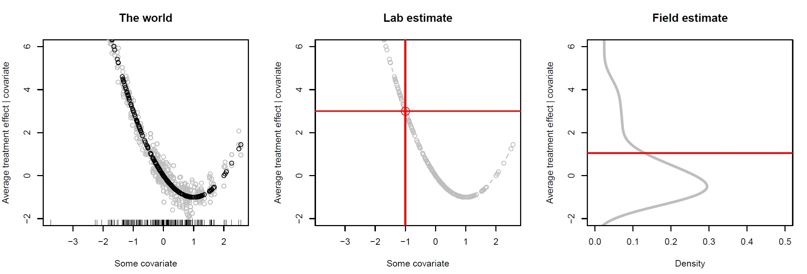

```{r, include = FALSE}
source(here::here("slides", "setup.R"))
child <- TRUE
knitr::opts_knit$set(root.dir = here::here("slides"))

```

## Plan

Let's discuss:

* Experimentation and the four parts to any design
* The stages of an experimental design
* Examples of the kinds of questions people address
* The ethics of intervening

Then:  Deep dive into discussion of actual experiments

Then: Plans for our own


## Introduction to experimentation

### What is an experiment?

Cox & Reid (2000) define experiments as:

> investigations in which an intervention, in all its essential elements, is under the control of the investigator. 

Two types of control: 

* control over assignment to treatment and 
* control over the treatment itself

### Two types of control: 




### More broadly:

Experimental studies use research designs in which the researchers uses:

* *interventional* **data strategies** (to control setting or treatments)
* often with **causal** *inquiries*
* often with **design based** *answer strategies*


## The MIDA Framework {#MIDAframework}

```{r, child = "topics/MIDA.qmd"}

```


```{r, child = "topics/stages.qmd"}

```


```{r, child = "topics/finding_questions.qmd"}

```


```{r, child = "topics/ethics.qmd"}

```


```{r, child = "topics/open_science.qmd"}

```

