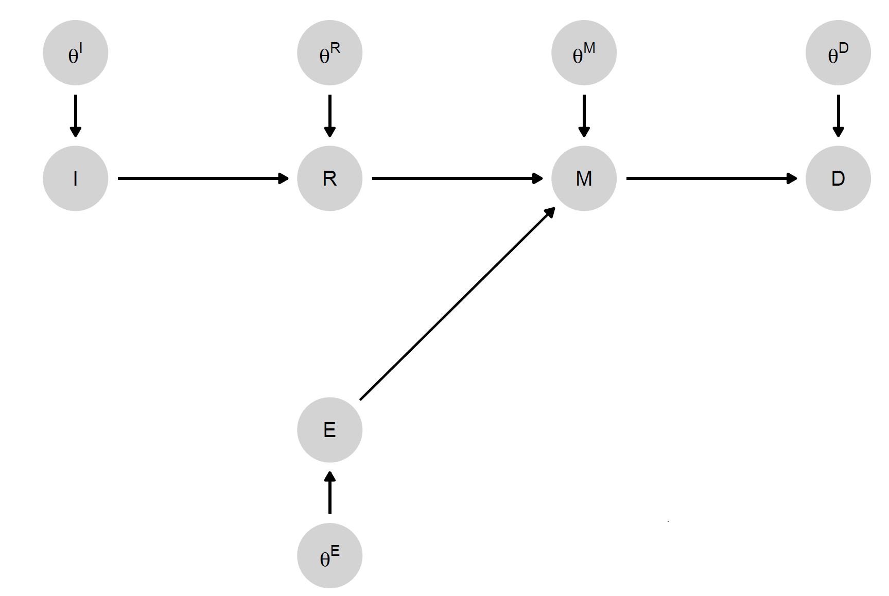

```{r, include = FALSE}

source("setup.R")

```

## DAGs

*Directed Acyclic Graphs*

```{r, echo = FALSE}
make_model("A -> B -> C <- D -> B") |> plot()

```

### Key insight {.smaller}

The most powerful results from the study of DAGs give procedures for figuring out when conditioning aids or hinders causal identification.

-   You can read off a **confounding** variable from a DAG.
    -   You figure out what to condition on for causal identification.
-   You can read off **"colliders"** from a DAG
    -   Sometimes you have to *avoid* conditioning on these
-   Sometimes a variable might be both, so
    -   you have to condition on it
    -   you have to avoid conditioning on it
    -   Ouch.

### Key resource

-   Pearl's book *Causality* is the key reference. @pearl2009causality (Though see also older work such as @pearl1985graphoids)

-   There is a lot of excellent material on Pearl's page <http://bayes.cs.ucla.edu/WHY/>

-   See also excellent material on Felix Elwert's page <http://www.ssc.wisc.edu/~felwert/causality/?page_id=66>

### Challenge for us

-   Say you don't like graphs. Fine.\

-   Consider this causal structure:

    -   $Z = f_1(U_1, U_2)$
    -   $X = f_2(U_2)$
    -   $Y = f_3(X, U_1)$

Say $Z$ is temporally prior to $X$; it is correlated with $Y$ (because of $U_1$) and with $X$ (because of $U_2$).

**Question:** Would it be useful to "control" for $Z$ when trying to estimate the effect of $X$ on $Y$?
 
 
## Challenge for us

-   Say you don't like graphs. Fine.\

-   Consider this causal structure:

    -   $Z = f_1(U_1, U_2)$
    -   $X = f_2(U_2)$
    -   $Y = f_3(X, U_1)$

**Question:** Would it be useful to "control" for $Z$ when trying to estimate the effect of $X$ on $Y$?

**Answer:** Hopefully by the end of today you should see that the answer is obviously (or at least, plausibly) "no."

## Conditional independence and graph structure {.smaller}

* What DAGs do is tell you when one variable is independent of another variable given some third variable.
* Intuitively:
  * what variables "shield off" the influence of one variable on another
  * e.g. If inequality causes revolution *via* discontent, then inequality and  revolution should be related to each other overall, but *not* related to each other *among those* that are content or *among those* that are discontent 

### Conditional independence

Variable sets $A$ and $B$ are conditionally independent, given $C$ if for all $a$, $b$, $c$:

$$\Pr(A = a | C = c) = \Pr(A = a | B = b, C = c)$$

Informally; given $C$, knowing $B$ tells you nothing more about $A$.


### Conditional independence  on paths  graphs

```{r HJ-F-2-4, echo = FALSE, fig.width = 6, fig.height = 4,  fig.align="center", out.width='70%', fig.cap = "Three elemental relations of conditional independence."}
p1 <- hj_ggdag(x = c(-1, 0, 1), y = c(1,1,1), names = c( "A", "B", "C" ),
       arcs = cbind( c(1, 2),
                     c(2, 3)), labelparse = FALSE,
       title = "(1) A path of arrows pointing in the same direction", padding = .2)
p2 <- hj_ggdag(x = c(-1, 0, 1), y = c(1,1,1), names = c( "A", "B", "C" ),
       arcs = cbind( c(2, 2),
                     c(1, 3)), labelparse = FALSE,
       title = "(2) A forked path", padding = .2) 
p3 <- hj_ggdag(x = c(-1, 0, 1), y = c(1,1,1), names = c( "A", "B", "C" ),
       arcs = cbind( c(1, 3),
                     c(2, 2)), labelparse = FALSE,
       title = "(3) An inverted fork (collision)", padding = .2)

plot_grid(plotlist = list(p1,p2,p3),ncol=1)

```


### Conditional independence  from graphs {.smaller}

$A$ and $B$ are *conditionally independent*, given $C$ if on *every* path between $A$ and $B$:

-   there is some chain ($\bullet\rightarrow \bullet\rightarrow\bullet$ or $\bullet\leftarrow \bullet\leftarrow\bullet$) or fork ($\bullet\leftarrow \bullet\rightarrow\bullet$) with the central element in $C$,

or

-   there is an inverted fork ($\bullet\rightarrow \bullet\leftarrow\bullet$) with the central element (and its descendants) *not* in $C$

Notes:

-   In this case we say that $A$ and $B$ are d-separated by $C$.
-   $A$, $B$, and $C$ can all be sets
-   Note that a path can involve arrows pointing any direction $\bullet\rightarrow \bullet\rightarrow \bullet\leftarrow \bullet\rightarrow\bullet$

### Test yourself {.smaller}

```{r, echo = FALSE, fig.width = 5, fig.height = 2,  fig.align="center", out.width='.9\\textwidth'}
hj_ggdag(x = 1:4, y = c(1, 1,1,1), names = c( "A", "B", "C", "D" ),
       arcs = cbind( c(1, 3, 3),
                     c(2, 2, 4)), labelparse = FALSE,
       title = " ", padding = .4, contraction = .15) 

```

Are A and D unconditionally independent:

-   if you do not condition on anything?
-   if you condition on B?
-   if you condition on C?
-   if you condition on B and C?

### Back to this example {.smaller}

* $Z = f_1(U_1, U_2)$
* $X = f_2(U_2)$
* $Y = f_3(X, U_1)$

1.  Let's graph this
2.  Now: say we removed the arrow from $X$ to $Y$
    -   Would you expect to see a correlation between $X$ and $Y$ if you did not control for $Z$
    -   Would you expect to see a correlation between $X$ and $Y$ if you did control for $Z$

### Back to this example {.smaller}

```{r, echo = FALSE}
make_model("X -> Y <- U1 -> Z <- U2 -> X") |> 
  plot(x_coord = c(3,1,1,2,3), y_coord = c(2,2,1,1.5,1))

```

Now: say we removed the arrow from $X$ to $Y$

-   Would you expect to see a correlation between $X$ and $Y$ if you did not control for $Z$?
-   Would you expect to see a correlation between $X$ and $Y$ if you did control for $Z$?


<!-- ## Conditional independence: formal properties  -->

<!-- ### Conditional distributions: Factorization from graphs{.smaller} -->

<!-- -   A DAG is just a graph in which some or all nodes are connected by *directed* edges (arrows) and there are no cyclical paths along these directed edges. -->
<!-- -   Informally, an arrow, $A \rightarrow B$ means that $A$ is a cause of $B$: that is, under some conditions, a change in $A$ produces a change in $B$. -->
<!--   -   Arrows carry no information about the type of effect; e.g. sign, size, or whether different causes are complements or substitutes -->
<!--   -   We say that arrows point from *parents* to *children*, and by extension from *ancestors* to *descendants*. -->
<!-- -   It is easy to see parents *on the graph*; but we want to connect them more formally to the idea of "Markovian parents" in a probability distribution $P$. -->
<!-- -   We want to use DAGs  to represent relations of conditional independence. -->

<!-- ### Conditional distributions: Factorization {.smaller} -->

<!-- -   Consider a situation with variables $X_1, X_2, \dots X_n$ -->
<!-- -   The probability of outcome $x$ can always be written in the form $P(X_1 = x_1)P(X_2 = x_2|X_1=x_1)(X_3 = x_3|X_1=x_1, X_2 = x_2)\dots$. -->
<!-- -   This can be done with any ordering of variables. -->
<!-- -   However the representation can be greatly simplified if you can make use of a set of "parentage" relationships -->
<!-- -   Given an ordering of variables, the **Markovian parents** of variable $X_j$ are the minimal set of variables such that when you condition on these, $X_j$ is independent of all other prior variables in the ordering -->
<!-- -   We want to get to the point where we can can write: $P(x) = \prod_j(x_j | pa_j)$ -->


<!-- ### Conditional distributions: Markov condition {.smaller} -->

<!-- -   Consider a DAG, $G$, and consider the ancestry relations implied by $G$: the distribution $P$ is *Markov relative to the graph* $G$ if every variable is independent of its nondescendants (in $G$) conditional on its parents (in $G$). -->
<!--     -   **Markov condition**: conditional on its parents, a variable is independent of its non-descendants. -->

<!-- Now we have what we need to simplify: **if the Markov condition is satisfied**, then instead of writing the full probability as $P(x) = P(x_1)P(x_2|x_1)P(x_3|x_1, x_2)$ we can write $P(x) = \prod_i P(x_i |pa_i)$. -->

<!-- ### Illustration {.smaller} -->

<!-- ```{r, echo = FALSE} -->

<!-- make_model("A -> B -> C") |> plot() -->

<!-- ``` -->

<!-- If $P(a,b,c)$ is Markov relative to this graph then: $C$ is independent of $A$ given $B$ -->

<!-- And instead of  -->

<!-- $$\Pr(a,b,c) = \Pr(a)\Pr(a|b)\Pr(c|a, b)$$  -->

<!-- we could now write: -->

<!-- $$\Pr(a,b,c) = \Pr(a)\Pr(a|b)\Pr(c|b)$$  -->

<!-- ### Conditional distributions and interventions {.smaller} -->

<!-- We want the graphs to be able to represent the effects of interventions. -->

<!-- Pearl uses `do` notation to capture this idea. -->

<!-- $$\Pr(X_1, X_2,\dots | do(X_j = x_j))$$ or -->

<!-- $$\Pr(X_1, X_2,\dots | \hat{x}_j)$$ -->

<!-- denotes the distribution of $X$ when a particular node (or set of nodes) is *intervened upon* and forced to a particular level, $x_j$. -->

<!-- ### Conditional distributions given `do` operations {.smaller} -->

<!-- Note, in general: $$\Pr(X_1, X_2,\dots | do(X_j = x_j')) \neq \Pr(X_1, X_2,\dots | X_j = x_j')$$ as an example we might imagine a situation where: -->

<!-- * for men, binary $X$ always causes $Y=1$  -->
<!-- * for women, $Y=0$ regardless of $X$ -->
<!-- * $X=1$ for men only. -->

<!-- In that case $\Pr(Y=1 | X = 1) = 1$ but $\Pr(Y=1 | do(X = 1)) = .5$ -->

<!-- ### Conditional distributions 6 {.smaller} -->

<!-- -   Let $P_{z}$ denote the resulting distribution on all variables that arises when vector $Z$ is "set" (forced, controlled...) to the value $z$. That is when we have `do(Z=z)`. -->

<!-- -   Let $P_*$ denote the set of all such distributions that can result from any set of interventions on variables. -->

<!-- -   A DAG, $G$, is a **causal Bayesian network compatible with** $P_*$ if, for all interventions $z$: -->

<!--     1.  $P_{z}$ is Markov relative to $G$ -->
<!--     2.  $P_z(x_i)=1$ for all $x_i$ consistent with $z$ -->
<!--     3.  $P_z(x_j|pa_j)=P(x_j|pa_j)$ for all $x_j \not\in Z$ when $pa_j$ is consistent with $z$ -->

### Conditional distributions given `do` operations {.smaller}

We nor formalize things a little more:

* The probability of outcome $x$ can always be written in the form 
$$P(X_1 = x_1)P(X_2 = x_2|X_1=x_1)(X_3 = x_3|X_1=x_1, X_2 = x_2)\dots$$ 

* This can be done with any ordering of variables. 

* We want to describe the distribution in a simpler way that takes account of *parent-child* relations and that can be used to capture interventions.

### Conditional distributions given `do` operations {.smaller}

* Given an ordering of variables, the **Markovian parents** of variable $X_j$ are the minimal set of variables such that when you condition on these, $X_j$ is independent of all other prior variables in the ordering 

$$P: P(x_1,x_2,\dots x_n) = \prod_{}P(x_j|pa_j)$$


* A DAG is "*causal Bayesian network*" or "*Causal DAG*" if (and only if) the probability distribution resulting from setting some set $X_i$ to $\hat{x}'_i$ (i.e. `do(X=x')`) is:

$$P_{\hat{x}_i}: P(x_1,x_2,\dots x_n|\hat{x}_i) = \mathbb{I}(x_i = x_i')\prod_{-i}P(x_j|pa_j)$$

*where the parents $pa_j$ are the parents on the graph*  (parents of $x_i$ are the nodes with arrows pointing into $x_i$.)


### Conditional distributions given `do` operations {.smaller}

So:

$$P_{\hat{x}_i}: P(x_1,x_2,\dots x_n|\hat{x}_i) = \mathbb{I}(x_i = x_i')\prod_{-i}P(x_j|pa_j)$$

* This means that there is only probability mass on vectors in which $x_i = x_i'$ (reflecting the success of control) and all other variables are determined by their parents, given the values that have been set for $x_i$.

* Such expressions will be critical later when we want to consider identificatation.

* They let us assess whether the probability of an outcome $y$, say, depends on the value of some other node, given some other node, or given *interventions* on some other node.


### Conditional distributions given `do` operations {.smaller}

Illustration, say we have binary $X$ causes binary $M$ which cases binary $Y$; say we intervene and set $M=1$. Then what is the distribution of $(x,m,y)$?

It is:

$$\Pr(x,m,y) = \Pr(x)\mathbb I(M = 1)\Pr(y|m)$$

### Application

We will use these ideas to motivate a general procedure for learning about, updating over, and querying, causal models.

## Causal models

### From graphs to Causal Models {.smaller}

A "**causal model**" is:

1.Variables

  * An ordered list of $n$ endogenous nodes, $\mathcal{V}= (V^1, V^2,\dots, V^n)$, with a specification of a range for each of them
  * A list of $n$ exogenous nodes, $\Theta = (\theta^1, \theta^2,\dots , \theta^n)$

2. A list of $n$ functions $\mathcal{F}= (f^1, f^2,\dots, f^n)$, one for each element of $\mathcal{V}$ such that each $f^i$ takes as arguments $\theta^i$ as well as elements of $\mathcal{V}$ that are *prior* to $V^i$ in the ordering

3. A probability distribution over $\Theta$


### From graphs to Causal Models

```{r HJ-F-2-1, echo = FALSE, out.width='60%', fig.align="center", out.width='80%', fig.cap = "A simple causal model in which high inequality ($I$) affects democratization ($D$) via redistributive demands ($R$) and mass mobilization ($M$), which is also a function of ethnic homogeneity ($E$). Arrows show relations of causal dependence between variables."}



```


```{r HJ-F-2-1x, echo = FALSE, out.width='60%', fig.width = 7, fig.height = 5,  fig.align="center", out.width='80%', fig.cap = "A simple causal model in which high inequality ($I$) affects democratization ($D$) via redistributive demands ($R$) and mass mobilization ($M$), which is also a function of ethnic homogeneity ($E$). Arrows show relations of causal dependence between variables.", eval = FALSE, include = FALSE}

## FLAG-- stopped working

hj_ggdag(x = c(0, 1, 2, 1, 3, 3, 2, 1, 0, 1),
       y = c(2, 2, 2, 0, 2, 3, 3, 3, 3, -1),
       names = c(
         "I", 
         "R",
         "M",
         "E", 
         "D", 
#         expression(paste(theta^D)),
#         expression(paste(theta^M)),
#         expression(paste(theta^R)),
#         expression(paste(theta^I)),
#         expression(paste(theta^E)) 
         "theta^D",
         "theta^M",
         "theta^R",
          "theta^I",
         "theta^E" 
         ),
       arcs = cbind( c(1, 2, 4, 3, 6, 7, 8, 9, 10),
                     c(2, 3, 3, 5, 5, 3, 2, 1, 4)),
       title = "A model of inequality's effect on democratization",
       padding = .2,  labelparse = FALSE,

       nodecol = "lightgrey",
       textcol = "black")

```

### Effects on a DAG

* Learning about effects *given* a model means learning about $F$ and *also* the distribution of shocks ($\Theta$).

* For discrete data this can be reduced to a question about learning about the distribution of $\Theta$ only.

### Effects on a DAG {.smaller}

For instance the simplest model consistent with $X \rightarrow Y$:

* Endogenous Nodes = $\{X, Y\}$, both with range $\{0,1\}$
* Exogenous Nodes = $\{\theta^X, \theta^Y\}$, with ranges $\{\theta^X_0, \theta^X_1\}$ and $\{\theta^Y_{00}\theta^Y_{01}, \theta^Y_{10}, \theta^Y_{11}\}$

*  Functional equations:

    -   $f_Y$: $\theta^Y =\theta^Y_{ij} \rightarrow \{Y = i \text{ if } X=0; Y = j \text{ if } X=1\}$
    -   $f_X$: $\theta^X =\theta^X_{i} \rightarrow \{X = i\}$


*  Distributions on $\Theta$: $\Pr(\theta^i = \theta^i_k) = \lambda^i_k$

### Effects as statement about exogeneous variables

What is the probability that $X$ has a positive causal effect on $Y$? 

* This is equivalent to: $\Pr(\theta^Y =\theta^Y_{01}) = \lambda^Y_{01}$

* So we want to learn about the distributions of the exogenous nodes

* This general principle extends to a vast class of causal models


