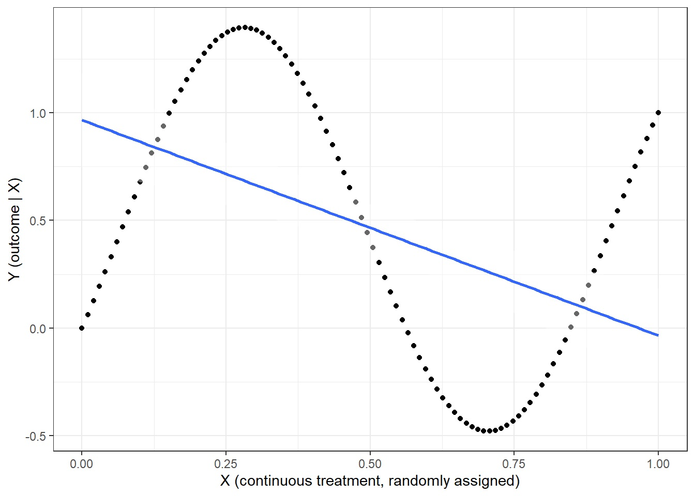
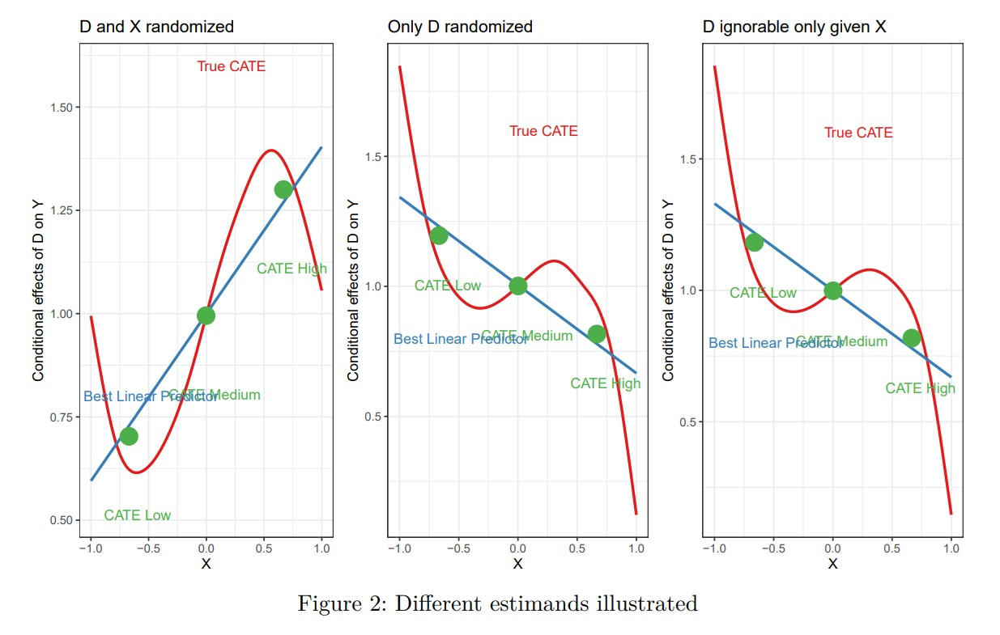

```{r, include = FALSE}

source("setup.R")

```


## Estimands and inquiries

-   Your **inquiry** is your question and the **estimand** is the true (generally unknown) answer to the inquiry
-   The estimand is the thing you want to estimate
-   If you are estimating something you should be able to say what your estimand is
-   You are responsible for your estimand. Your estimator will not tell you what your estimand is
-   Just because you can calculate something does not mean that you have an estimand
-   You can test a hypothesis without having an estimand

Read: [II ch 4](https://macartan.github.io/integrated_inferences/HJC4.html), [DD, ch 7](https://book.declaredesign.org/declaration-diagnosis-redesign/defining-inquiry.html)

### Estimands: ATE, ATT, ATC, S-, P- {.smaller}

-   ATE is Average Treatment Effect (all units)
-   ATT is Average Treatment Effect on the Treated
-   ATC is Average Treatment Effect on the Controls

### Estimands: ATE, ATT, ATC, S-, P- {.smaller}

Say that units are randomly assigned to treatment in different strata (maybe just one); with fixed, though possibly different, shares assigned in each stratum. Then the key estimands and estimators are:

| Estimand                                         | Estimator                                                                                                 |
|--------------------------------|----------------------------------------|
| $\tau_{ATE} \equiv \mathbb{E}[\tau_i]$           | $\widehat{\tau}_{ATE} = \sum\nolimits_{x} \frac{w_x}{\sum\nolimits_{j}w_{j}}\widehat{\tau}_x$             |
| $\tau_{ATT} \equiv \mathbb{E}[\tau_i | Z_i = 1]$ | $\widehat{\tau}_{ATT} = \sum\nolimits_{x} \frac{p_xw_x}{\sum\nolimits_{j}p_jw_j}\widehat{\tau}_x$         |
| $\tau_{ATC} \equiv \mathbb{E}[\tau_i | Z_i = 0]$ | $\widehat{\tau}_{ATC} = \sum\nolimits_{x} \frac{(1-p_x)w_x}{\sum\nolimits_{j}(1-p_j)w_j}\widehat{\tau}_x$ |

where $x$ indexes strata, $p_x$ is the share of units in each stratum that is treated, and $w_x$ is the size of a stratum.

### Estimands: ATE, ATT, ATC, S-, P-, C-

In addition, each of these can be targets of interest:

-   for the **population**, in which case we refer to PATE, PATT, PATC and $\widehat{PATE}, \widehat{PATT}, \widehat{PATC}$
-   for a **sample**, in which case we refer to SATE, SATT, SATC, and $\widehat{SATE}, \widehat{SATT}, \widehat{SATC}$

And for different subgroups,

-   given some value on a covariate, in which case we refer to CATE (conditional average treatment effect)

### Broader classes of estimands: LATE/CATE {.smaller}

The CATEs are **conditional** average treatment effects, for example the effect for men or for women. These are straightfoward.

However we might also imagine conditioning on unobservable or counterfactual features.

-   The LATE (or CACE: "complier average causal effect") asks about the effect of a treatment ($X$) on an outcome ($Y$) *for people that are responsive to an encouragement* ($Z$)

$$LATE =  \frac{1}{|C|}\sum_{j\in C}(Y_j(X=1) - Y_j(X=0))$$ $$C:=\{j:X_j(Z=1) > X_j(Z=0) \}$$

We will return to these in the study of instrumental variables.

### Quantile estimands

Other ways to condition on potential outcomes:

-   A *quantile* treatment effect: You might be interested in the difference between the median $Y(1)$ and the median $Y(0)$ (@imbens2015causal 20.3.1)
-   or even be interested in the median $Y(1) - Y(0)$. Similarly for other quantiles.

### Model estimands

Many inquiries are averages of individual effects, even if the groups are not known, but they do not have to be:

-   The RDD estimand is a statement about what effects *would be* at a threshold; it can be defined under a model even if no actual individuals are at the threshold. We imagine average potential outcomes as a function of treatment $Z$ and running variable $X$, $f(z, x)$ and define: $$\tau_{RDD} := f(1, x^*) - f(0, x^*)$$

### Distribution estimands {.smaller}

Many inquiries are averages of individual effects, even if the groups are not known,

But they do not have to be:

-   Inquiries might relate to distributional quantities such as:

    -   The effect of treatment on the variance in outcomes: $var(Y(1)) - var(Y(0))$
    -   The variance of treatment effects: $var(Y(1) - Y(0))$
    -   Other inequality measures (e.g. Ginis; (@imbens2015causal 20.3.2))

You might even be interested in $\min(Y_i(1) - Y_i(0))$.

### Spillover estimands {.smaller}

There are lots of interesting "spillover" estimands.

Imagine there are three individuals and each person's outcomes depends on the assignments of all others. For instance $Y_1(Z_1, Z_2, Z_3$, or more generally, $Y_i(Z_i, Z_{i+1 (\text{mod }3)}, Z_{i+2 (\text{mod }3)})$.

Then three estimands might be:

-   $\frac13\left(\sum_{i}{Y_i(1,0,0) - Y_i(0,0,0)}\right)$
-   $\frac13\left(\sum_{i}{Y_i(1,1,1) - Y_i(0,0,0)}\right)$
-   $\frac13\left(\sum_{i}{Y_i(0,1,1) - Y_i(0,0,0)}\right)$

Interpret these. What others might be of  interest?

### Estimands for a continuous treatment

Say our treatment $X$ varies continuous over $[0,1]$, and is randomly assigned.

What estimand captures "the average effect of $X$ on $Y$?

```{r, echo = FALSE}

```

### Differences in CATEs and interaction estimands {.smaller}

A difference in CATEs is a well defined estimand that might involve interventions on one node only:

-   $\mathbb{E}_{\{W=1\}}[Y(X=1) - Y(X=0)] - \mathbb{E}_{\{W=0\}}[Y(X=1) - Y(X=0)]$

It captures differences in effects.

An *interaction* is an effect on an effect:

-   $\mathbb{E}[Y(X=1, W=1) - Y(X=0, W=1)] - \mathbb{E}[Y(X=1, W=0) - Y(X=0, W=0)]$

Note in the latter the expectation is taken over the whole population.

Do not mix these up!


```{r, eval = FALSE, echo = FALSE}
# Helpers

f_Y <- function(D, X, U_Y, U_X) U_Y +  D*(1 + U_X + X + X*U_Y  - X^3)
fx <- .005
b_X_D = 1
rho = -.75

binning_estimator <-
  function(data) {
    # interflex can't suppress sprintf'd messages
    fit <- interflex(
      estimator = 'binning',
      data = data,
      Y = "Y", D = "D", X = "X",
      base = "0", figure = FALSE,
    ) |> 
      suppressMessages()
    
    fit$est.bin |>
      as.data.frame() |>
      transmute(
        estimate = X1.coef,
        std.error = X1.sd,
        conf.low = X1.CI.lower,
        conf.high = X1.CI.upper
      )
  }

interprobe_estimator_1 <-
  function(data) {
    fit <- interprobe(
      data = data,
      x = "D", z = "X", y = "Y", k = 8, quiet = TRUE    
    ) |> suppressMessages()
    fit$johnson.neyman|> filter(X == min(X)) |>
      rename(estimate = marginal.effect)
  }

interprobe_estimator_2 <-
  function(data) {
    fit <- interprobe(
      data = data,
      x = "D", z = "X", y = "Y", k = 8, quiet = TRUE  
    ) |> suppressMessages()

    data.frame(estimate = (fit$johnson.neyman$marginal.effect[100] - fit$johnson.neyman$marginal.effect[1]) /
      (fit$johnson.neyman$X[100] - fit$johnson.neyman$X[1])) / (max(data$X) - min(data$X))
    
  }

# this figures the difference between you and your closest neighbor
neighbors_actual <-
  function(data)
    data <- data |> 
  mutate(tau_dx = sapply(1:n(), function(i) {
    distances <- abs(X - X[i])
    distances[i] <- Inf # Exclude the point itself
    neighbor_index <- which.min(distances)
    tau[neighbor_index]
  }),
  dx = sapply(1:n(), function(i) {
    distances <- abs(X - X[i])
    distances[i] <- Inf # Exclude the point itself
    min(distances) # Distance to closest neighbor
  }))

# this figures the difference between you and your right neighborhood

neighbors_bin <-
  function(data, dx = .02)
  data <- data |> 
  mutate(
    tau_dx = 
      sapply(1:n(), 
             function(i) {
               mean(tau[(X >= X[i]) & (X <= X[i] + dx)])}),
    dx = dx
  )

pop_var <- function(x) {
  mean((x - mean(x)) ^ 2)
}

pop_cov <- function(x, y) {
  mean((x - mean(x)) * (y - mean(y)))
}

design  <- 
  
  declare_model(
    N = 50000,
    U_Y = runif(N, -1, 1),
    U_X = runif(N, -1, 1),
    X = correlate(given = U_X, rho = rho, runif, min =  -1, max = 1),
    D = 1* (runif(N, -1, 1) < b_X_D*X),
    B = cut(X, 3, c("low", "medium", "high")), # Bins
    Y1 = f_Y(1, X, U_Y, U_X),
    XL  = X - mean(X[B=="low"]),
    XM  = X - mean(X[B=="medium"]),
    XH  = X - mean(X[B=="high"]),
    Y0 = f_Y(0, X, U_Y, U_X),
    tau = Y1 - Y0, 
    tau_fx = f_Y(1, X+fx, U_Y, U_X) - f_Y(0, X+fx, U_Y, U_X), 
    Y = f_Y(D, X, U_Y, U_X)
  ) +
  
  declare_measurement(handler = neighbors_bin) +
  
  declare_inquiry(
    ATE = mean(tau),
    BLP = pop_cov(tau, X) / pop_var(X),
    CATE_min = mean(tau[X < -.996]),
    CATE_L = mean(tau[B == "low"]),
    CATE_M = mean(tau[B == "medium"]),
    CATE_H = mean(tau[B == "high"]),
    D_CATE = mean(tau[B == "high"]) - mean(tau[B == "low"]),
    tau_CATE = mean(
      (f_Y(1, mean(X[B == "high"]), U_Y, U_X) - f_Y(0, mean(X[B == "high"]), U_Y, U_X)) - 
        (f_Y(1, mean(X[B == "low"] ), U_Y, U_X) - f_Y(0, mean(X[B == "low"]), U_Y, U_X))),
    ADC = mean((tau_dx - tau) / dx),
    AIE = mean((tau_fx - tau) / fx), 
    )  +
  
  declare_estimator(Y ~ D,  inquiry = "ATE", label = "ATE") +
  declare_estimator(Y ~ X + D + X*D,  term = "X:D", 
                    inquiry = "BLP", label = "BLP") +
  declare_estimator(handler = label_estimator(interprobe_estimator_1), 
                    label = "interprobe 1", inquiry = "CATE_min")+
  declare_estimator(Y ~ D*XL, subset = B == "low", 
                    inquiry = "CATE_L", label = "CATE_L") + 
  declare_estimator(Y ~ D*XM, subset = B == "medium", 
                    inquiry = "CATE_M", label = "CATE_M") + 
  declare_estimator(Y ~ D*XH, subset = B == "high", 
                    inquiry = "CATE_H", label = "CATE_H") + 
  # This is too constrained
  declare_estimator(Y ~ D*B , subset = B %in% c("low", "high"), term = "D:Bhigh",
                    inquiry = c("D_CATE", "tau_CATE"), label = "D_CATE") + 
  declare_estimator(handler = label_estimator(interprobe_estimator_2), 
                    label = "interprobe 2", inquiry = c("AIE", "ADC"))

estimands <- draw_estimands(design) 

estimands <- estimands |> mutate(inquiry = factor(inquiry, formal_definitions$labels, formal_definitions$meaning ))

estimands |> kable(digits = 2)

dat <- draw_data(design) 

interprobe_plot <-
  interprobe(
    data = dat,
    x = "D",
    z = "X",
    y = "Y",
    k = 5,
    draw = "jn"
  )

f_estimand_plot <- function(dat) { 
summary_dat <- 
  dat |> 
  group_by(B) |> 
  summarize(X = median(X), 
            tau = mean(tau))

colors_set1 <- RColorBrewer::brewer.pal(n = 3, name = "Set1")

label_df <-
  tibble(
    X = c(summary_dat$X + .075, -0.48, 0.22),
    tau = c(summary_dat$tau - 0.19, 0.8, 1.6),
    label = c("CATE Low", "CATE Medium", "CATE High", "Best Linear Predictor", "True CATE"),
    color = colors_set1[c(3, 3, 3, 2, 1)]
  )


  ggplot(dat, aes(X, tau)) + 
  geom_smooth(color = colors_set1[1], se = FALSE) + 
  geom_smooth(method = "lm", color = colors_set1[2], se = FALSE) + 
  geom_point(data = summary_dat,
             aes(X, tau), color = colors_set1[3], size = 6) +
  geom_text(data = label_df, aes(label = label, color = color)) +
  scale_color_identity() +
  labs(y = "Conditional effects of D on Y") +
  theme_bw() +
  theme(axis.title = element_markdown())
}
```


## Interaction estimands

Consider a binary treatment D, randomized. and an interest in the way X -- possibly randomized -- moderates the effect of D.

```{r, echo = FALSE}

```
## Interaction estimands

The estimands can be seen from the following graphs:

* Black points show actual marginal effects
* The BLP (blue line) is positively sloped
* The "average modification" effect is 0: this is the difference between the most left and most right marginal effect
* The interprobe fitted values are in red
* The CATES within bins are marked green
* The effect at the lowest X is on the further left blackpoint

## Interaction estimands {.smaller}

```{r, echo = FALSE}
formal_definitions <- 
  data.frame(
    labels = c("ATE", "BLP", "CATE_min", "CATE_L", "CATE_M", "CATE_H",  "D_CATE", "tau_CATE", "ADC" ,"AIE"),

    inquiry = c(
      "$\\text{ATE}$", 
      "$\\text{BLP}$", 
      "$\\text{CATE}_{\\min}$",  
      "$\\text{CATE}_{\\text{L}}$",  
      "$\\text{CATE}_{\\text{M}}$", 
      "$\\text{CATE}_{\\text{H}}$", 
      "$\\Delta_{\\text{CATE}}$", 
      "$\\tau_{\\text{CATE}}$", 
      "$\\text{ADC}$",
      "$\\text{AIE}$" 
    ),
    meaning = c(
      "Average treatment effect",
      "Best linear predictor",
      "CATE at min $x$",
      "CATE for the lower bound group",
      "CATE for the medium group",
      "CATE for the high group",
      "Difference in CATEs (H v. L)",
      "Effect of group on group CATEs (H v. L)",
      "Average difference in CATEs",
      "Average interaction effect"
    ),
formal_definition = c(
  "$\\mathbb{E}[Y_1 - Y_0]$", 
  "$b \\text{ from } \\arg\\min_{a, b} \\mathbb{E}[((Y_1 - Y_0) - (a + bX))^2]$", 
  "$\\mathbb{E}[Y_1 - Y_0 \\mid X = \\min(X)]$", 
  "$\\mathbb{E}[Y_1 - Y_0 \\mid X \\in \\text{L}]$", 
  "$\\mathbb{E}[Y_1 - Y_0 \\mid X \\in \\text{M}]$", 
  "$\\mathbb{E}[Y_1 - Y_0 \\mid X \\in \\text{H}]$", 
  "$\\mathbb{E}[Y_1 - Y_0 \\mid X \\in \\text{H}] - \\mathbb{E}[Y_1 - Y_0 \\mid X \\in \\text{L}]$", 
  "$\\mathbb{E}[(Y(1, x_H^*) - Y(0, x_H^*)) - (Y(1, x_L^*) - Y(0, x_L^*))]$", 
  "$\\frac{\\mathbb{E}\\left[(Y_1 - Y_0 \\mid X = x + \\delta)\\right] - \\mathbb{E}\\left[(Y_1 - Y_0 \\mid X = x)\\right]}{\\delta}$",
  "$\\mathbb{E}\\left[\\frac{(Y(1, x+\\delta) - Y(0, x+\\delta)) - (Y(1, x) - Y(0, x))}{\\delta}\\right]$" 
)
)

formal_definitions |> kable()
```


### Mediation estimands and complex counterfactuals {.smaller}

Say $X$ can affect $Y$ directly, or indirectly through $M$. then we can write potential outcomes as:

-   $Y(X=x, M=m)$
-   $M(X=x)$

We can then imagine inquiries of the form:

-   $Y(X=1, M=M(X=1)) - Y(X=0, M=M(X=0))$
-   $Y(X=1, M=1) - Y(X=0, M=1)$
-   $Y(X=1, M=M(X=1)) - Y(X=1, M=M(X=0))$

Interpret these. What others might be of interest?

### Mediation estimands and complex counterfactuals

Again we might imagine that these are defined with respect to some group:

-   $A = \{i|Y_i(1, M(X=1)) > Y_i(0, M(X=0))\}$
-   $\frac{1}{|A|} \sum_{i\in A}(Y(1, 1) > Y(0, 1))$

here, *among those for whom* $X$ has a positive effect on $Y$, for what share would there be a positive effect if $M$ were fixed at 1?


### Causes of effects and effects of causes

In qualitative research a particularly common inquiry is "did $X=1$ cause $Y=1$?

This is often given as a probability, the "probability of causation" (though at the case level we might better think of this probability as an estimate rather than an estimand):

$$\Pr(Y_i(0) = 0 | Y_i(1) = 1, X = 1)$$

### Causes of effects and effects of causes

Intuition: What's the probability $X=1$ caused $Y=1$ in an $X=1, Y=1$ case drawn from a large population with the following experimental distribution:

|     | Y=0  | Y=1  | All |
|-----|------|------|-----|
| X=0 | 1    | 0    | 1   |
| X=1 | 0.25 | 0.75 | 1   |

### Causes of effects and effects of causes

Intuition: What's the probability $X=1$ caused $Y=1$ in an $X=1, Y=1$ case drawn from a large population with the following experimental distribution:

|     | Y=0  | Y=1  | All |
|-----|------|------|-----|
| X=0 | 0.75 | 0.25 | 1   |
| X=1 | 0.25 | 0.75 | 1   |

### Actual causation

Other inquiries focus on distinguishing between causes.

For the Billy Suzy problem [@hall2004two], @halpern2016actual focuses on "actual causation" as a way to distinguish between Suzy and Billy:

> Imagine Suzy and Billy, simultaneously throwing stones at a bottle. Both are excellent shots and hit whatever they aim at. Suzy's stone hits first, knocks over the bottle, and the bottle breaks. However, Billy's stone *would* have hit had Suzy's not hit, and again the bottle would have broken. Did Suzy's throw cause the bottle to break? Did Billy's?

### Actual causation

Actual Causation:

1.  $X=x$ and $Y=y$ both happened;
2.  there is some set of variables, $\mathcal W$, such that if they were fixed at the levels that they *actually took* on in the case, and if $X$ were to be changed, then $Y$ would change (where $\mathcal W$ can also be an empty set);
3.  no strict subset of $X$ satisfies 1 and 2 (there is no redundant part of the condition, $X=x$).

### Actual causation

-   Suzy: Condition 2 is met if Suzy's throw made a difference, counterfactually speaking---with the important caveat that, in determining this, we are permitted to condition on Billy' stone not hitting the bottle.
-   Billy: Condition 2 is not met.

An inquiry: for what share in a population is a possible cause an actual cause?

### Pearl's ladder

Pearl (e.g. @pearl2018book) describes three types of inquiry:

| Level  | Activity  | Inquiry  |
|-----------|-----------|----------------------|
| Association |"Seeing" | If I see $X=1$ should I expect $Y=1$? |
| Intervention |"Doing" | If I set $X$ to $1$ should I expect $Y=1$? |
| Counterfactual |"Imagining"  | If $X$ were $0$ instead of 1, would $Y$ then be $0$ instead of $1$? 

### Pearl's ladder

We can understand these as asking different types of questions about a causal model

| Level  | Activity  | Inquiry  |
|-----------|-----------|----------------------|
| Association |"Seeing"| $\Pr(Y=1|X=1)$ |
| Intervention |"Doing"| $\mathbb{E}[\mathbb{I}(Y(1)=1)]$|
| Counterfactual |"Imagining" | $\Pr(Y(1)=1 \& Y(0)=0)$ |

The third is qualitatively different because it requires information about two mutually incompatible conditions for units. This is not (generally ) recoverable directly from knowledge of $\Pr(Y(1)=1)$ and $\Pr(Y(0)=0)$.

